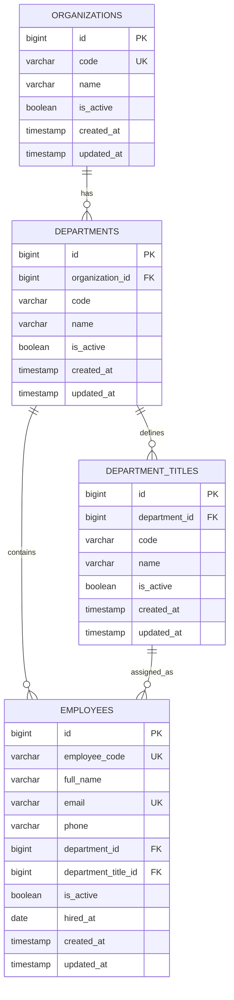

# HRM Database Design (Organization - Department - Employee)

## 1) Mục tiêu
Thiết kế DB cho các thực thể:
- `organizations` (tổ chức)
- `departments` (phòng ban, thuộc tổ chức)
- `department_titles` (chức danh theo phòng ban)
- `employees` (nhân viên, thuộc phòng ban và có chức danh tương ứng phòng ban đó)

Tất cả `organization`, `department`, `employee` đều có trạng thái hoạt động (`is_active`).

## 2) Data Model

### 2.1 Bảng `organizations`
| Cột | Kiểu | Ràng buộc | Ghi chú |
|---|---|---|---|
| id | BIGINT | PK, auto increment | Khóa chính |
| code | VARCHAR(50) | UNIQUE, NOT NULL | Mã tổ chức |
| name | VARCHAR(255) | NOT NULL | Tên tổ chức |
| is_active | BOOLEAN | NOT NULL, default true | Trạng thái hoạt động |
| created_at | TIMESTAMP |  | |
| updated_at | TIMESTAMP |  | |

### 2.2 Bảng `departments`
| Cột | Kiểu | Ràng buộc | Ghi chú |
|---|---|---|---|
| id | BIGINT | PK, auto increment | Khóa chính |
| organization_id | BIGINT | FK -> organizations.id, NOT NULL | Thuộc tổ chức |
| code | VARCHAR(50) | NOT NULL | Mã phòng ban (unique trong 1 tổ chức) |
| name | VARCHAR(255) | NOT NULL | Tên phòng ban |
| is_active | BOOLEAN | NOT NULL, default true | Trạng thái hoạt động |
| created_at | TIMESTAMP |  | |
| updated_at | TIMESTAMP |  | |

Ràng buộc:
- `UNIQUE (organization_id, code)`

### 2.3 Bảng `department_titles`
| Cột | Kiểu | Ràng buộc | Ghi chú |
|---|---|---|---|
| id | BIGINT | PK, auto increment | Khóa chính |
| department_id | BIGINT | FK -> departments.id, NOT NULL | Chức danh thuộc phòng ban |
| code | VARCHAR(50) | NOT NULL | Mã chức danh (unique trong phòng ban) |
| name | VARCHAR(255) | NOT NULL | Tên chức danh |
| is_active | BOOLEAN | NOT NULL, default true | Khuyến nghị để đóng/mở chức danh |
| created_at | TIMESTAMP |  | |
| updated_at | TIMESTAMP |  | |

Ràng buộc:
- `UNIQUE (department_id, code)`

### 2.4 Bảng `employees`
| Cột | Kiểu | Ràng buộc | Ghi chú |
|---|---|---|---|
| id | BIGINT | PK, auto increment | Khóa chính |
| employee_code | VARCHAR(50) | UNIQUE, NOT NULL | Mã nhân viên |
| full_name | VARCHAR(255) | NOT NULL | Họ tên |
| email | VARCHAR(255) | UNIQUE, NULL | Email |
| phone | VARCHAR(20) | NULL | SĐT |
| department_id | BIGINT | FK -> departments.id, NOT NULL | Nhân viên thuộc phòng ban |
| department_title_id | BIGINT | NOT NULL | Chức danh của nhân viên |
| is_active | BOOLEAN | NOT NULL, default true | Trạng thái hoạt động |
| hired_at | DATE | NULL | Ngày vào làm |
| created_at | TIMESTAMP |  | |
| updated_at | TIMESTAMP |  | |

Ràng buộc quan trọng:
- FK tổng hợp để đảm bảo chức danh đúng phòng ban:
  - `FOREIGN KEY (department_title_id, department_id)`
  - `REFERENCES department_titles(id, department_id)`

> Ý nghĩa: nhân viên chỉ có thể gán vào chức danh thuộc chính `department_id` của nhân viên đó.

## 3) Quan hệ giữa các model
- `Organization` `hasMany` `Department`
- `Department` `belongsTo` `Organization`
- `Department` `hasMany` `DepartmentTitle`
- `DepartmentTitle` `belongsTo` `Department`
- `Department` `hasMany` `Employee`
- `Employee` `belongsTo` `Department`
- `DepartmentTitle` `hasMany` `Employee`
- `Employee` `belongsTo` `DepartmentTitle`

## 4) ERD (Mermaid)


## 5) SQL mẫu (MySQL 8+)
```sql
CREATE TABLE organizations (
    id BIGINT UNSIGNED AUTO_INCREMENT PRIMARY KEY,
    code VARCHAR(50) NOT NULL UNIQUE,
    name VARCHAR(255) NOT NULL,
    is_active BOOLEAN NOT NULL DEFAULT TRUE,
    created_at TIMESTAMP NULL,
    updated_at TIMESTAMP NULL
);

CREATE TABLE departments (
    id BIGINT UNSIGNED AUTO_INCREMENT PRIMARY KEY,
    organization_id BIGINT UNSIGNED NOT NULL,
    code VARCHAR(50) NOT NULL,
    name VARCHAR(255) NOT NULL,
    is_active BOOLEAN NOT NULL DEFAULT TRUE,
    created_at TIMESTAMP NULL,
    updated_at TIMESTAMP NULL,
    CONSTRAINT fk_departments_organization
        FOREIGN KEY (organization_id) REFERENCES organizations(id),
    CONSTRAINT uk_departments_org_code
        UNIQUE (organization_id, code),
    CONSTRAINT uk_departments_id_org
        UNIQUE (id, organization_id)
);

CREATE TABLE department_titles (
    id BIGINT UNSIGNED AUTO_INCREMENT PRIMARY KEY,
    department_id BIGINT UNSIGNED NOT NULL,
    code VARCHAR(50) NOT NULL,
    name VARCHAR(255) NOT NULL,
    is_active BOOLEAN NOT NULL DEFAULT TRUE,
    created_at TIMESTAMP NULL,
    updated_at TIMESTAMP NULL,
    CONSTRAINT fk_titles_department
        FOREIGN KEY (department_id) REFERENCES departments(id),
    CONSTRAINT uk_titles_department_code
        UNIQUE (department_id, code),
    CONSTRAINT uk_titles_id_department
        UNIQUE (id, department_id)
);

CREATE TABLE employees (
    id BIGINT UNSIGNED AUTO_INCREMENT PRIMARY KEY,
    employee_code VARCHAR(50) NOT NULL UNIQUE,
    full_name VARCHAR(255) NOT NULL,
    email VARCHAR(255) NULL UNIQUE,
    phone VARCHAR(20) NULL,
    department_id BIGINT UNSIGNED NOT NULL,
    department_title_id BIGINT UNSIGNED NOT NULL,
    is_active BOOLEAN NOT NULL DEFAULT TRUE,
    hired_at DATE NULL,
    created_at TIMESTAMP NULL,
    updated_at TIMESTAMP NULL,
    CONSTRAINT fk_employees_department
        FOREIGN KEY (department_id) REFERENCES departments(id),
    CONSTRAINT fk_employees_title_department_pair
        FOREIGN KEY (department_title_id, department_id)
        REFERENCES department_titles(id, department_id)
);
```

## 6) Ghi chú triển khai
- Nếu cần lưu lịch sử chuyển phòng ban/chức danh, thêm bảng `employee_department_histories` để tránh mất dữ liệu quá khứ.
- Nếu bạn chỉ cần dữ liệu hiện tại (current state), model trên là đủ và đơn giản.
